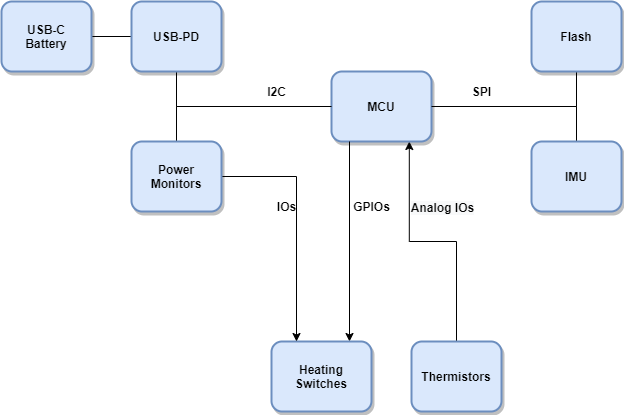
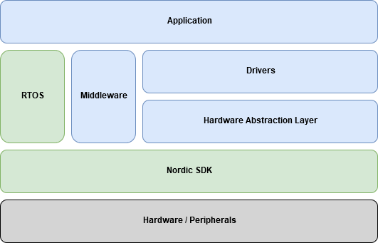

.. todo:: put a link to hardware requirements
.. todo:: review hardware requirments for SOUPs
.. todo:: put links to known SOUP issues
.. todo:: put the SOUP documentation as local files instead of web links
.. todo:: define how SOUP will be maintained (configuration Management?)
.. todo:: put a link to Firmware Detailed Design document
.. todo:: link other documents that reference the SOUPs
.. include:: _names.rst

.. _lbl_architectureplan:

Architecture Plan
#####################################################

    This document describes the architecture of the firmware used in the Baselayer module. It shows the high level hardware architecure, hardware peripherals, how the firmware interact with hardware and how the firmware components are structured. It also describes which :term:`SOUP` will be used. 
    
    A bottom-up approach was used to show the relation between the hardware and firmware, while the opposite was used to describe the firmware architeture: a top down approach is used, starting with a high level representation of the components and breaking them down to the description of each module.
  
    The inputs and guidelines for this document are: 
        * :ref:`lbl_overview` 
        * :ref:`lbl_requirements`
        * |iec62304|
        * |iec60601| 
        * |fdaots|

.. _lbl_hw_extperipherals:

Hardware Architecture - External Peripherals
**********************************************
This section provides a high level representation of the hardware where the firmware resides. It shows the microcontroller and the main external peripherals that interact with the firmware. 

The diagram is formed by the following blocks:

    * **MCU:** microcontroller unit
    * **IMU:** :term:`IMU` sensor
    * **USB-PD:** USB Type-C and Power Delivery (PD) controller
    * **Flash:** flash memory
    * **USB-C Battery:** battery with USB Type_C 
    * **Power Monitors:** current sensors
    * **Heating Switches:** switches passing power to heating elements
    * **Thermistors:** temperature sensors

The hardware blocks are connected with lines representing digital pins and communication interfaces. 
See also: :term:`GPIO`, :term:`SPI` and :term:`I2C`.

For detailed hardware information see ``[TBD] link to hardware specification``

.. _lbl_hw_intperipherals:

Microcontroller Architecture - Internal Peripherals
******************************************************
This section provides a high level representation of the microcontroller internals and the peripherals used by the firmware.

.. image:: graphics/uc_blocks.png
    :scale: 100 %
    :align: center

The diagram is formed by the following blocks:

    * **RAM**: :term:`RAM` memory
    * **ROM**: Flash Memory 
    * **ARM Cortex M4F**: Microcontroller core
    * **SPI 1 and SPI 2**: :term:`SPI` ports
    * **I2C**: :term:`I2C` port
    * **BLE**: :term:`BLE` peripheral
    * **RTC**: Real Time Counter
    * **WDT**: Watchdog Timer
    * **PWM**: Pulse Width Modulator
    * **GPIO**: General Purpose Input and Output

Microcontroller Specifications
=======================================
The microcontroller used in the Underwear module is the Nordic |nrf52|. The most relevant features for the Underwear project are listed below:

    * 64 MHz ARM Cortex M4F
    * 512 KB Flash Memory
    * 64 KB :term:`RAM`
    * Embedded :term:`BLE` 4.2 Peripheral
    * Two SPI ports
    * One I2C port
    * Two :term:`RTC`
    * 25 :term:`GPIO`
    * Independent Watchdog Timer

For detailed microcontroller information and specification see ``[TBD] link to hardware specification. uC specs should be shown``

.. _lbl_firmware_architecture:

Firmware Architecture
******************************************************
The Firmware can be divided in six different main components where each component is formed by one or more source code files that are also called modules. In this architecure, components are an abstract concept used to organize modules (source files) that implement the same type of functionalities. This hierarchical division between components and modules is used to simplify the comprehension of the Firmware Architecture that is shown in the diagram below. The blue boxes are firmware components written by Myant, green boxes are third party firmware components (:term:`SOUP`) and the grey box is the hardware.

Firmware Components 
=======================
This section shows a textual description of each firmware component.

Application
-----------------
This component gathers all the modules that implement the application functionalities.

Middleware
-----------------
The modules in the Middleaware component implement common functions that are used by the rest of the firmware. These functions act like an interface and as service providers encapsulating common code and simplifying the architecture. Common functionalites provided by the Middleware are: algorithms, data structures, synchronized access to hardware resources and RTOS interfacing. 

Drivers
-----------------
The drivers' modules implement the code used to configure and control internal and external peripherals. 
For more information about peripherals see: :ref:`lbl_hw_extperipherals` and :ref:`lbl_hw_intperipherals`

HAL - Hardware Abstraction Layer
-----------------------------------
The HAL is an interface layer used to isolate the hardware details from the rest of the firmware. It creates a standardized access layer to the hardware components.

..  _lbl_nordic_sdk:

SDK - Software Development Kit
---------------------------------------
This is a software package written by the microcontroller manufacturer. It contains peripherals' drivers, libraries and data structures that are deployed as source code and libraries. The SDK is considered as a :term:`SOUP`.

SDK Identification:

    * Manufacturer: |nordiclink|
    * Version: |sdkversion|
    * Manual and code: |sdkpage|    

SDK Minimal Hardware Requirements:

    * Microcontroller |nrf52|
    * 8 KB RAM memory
    * 112 KB Flash memory
    * ``[TBD] review memory requirements``

SDK functionalities used by the firmware:

    * :term:`BLE` v4.2 stack implementation.
    * Microcontroller peripherals' drivers: SPI, I2C, GPIO, RTC and WDT. See: :ref:`lbl_hw_intperipherals`.

List of Known Bugs

``[TBD] put a list of known issues``

..  _lbl_freertos:

RTOS - Real Time Operating System
---------------------------------------
An RTOS is used to provide multi tasks capabilities to the firmware. By using multi tasking an additional level of abstraction can be used to define the architecture making the firmware more scalable, decoupled, easier to maintain and test. The chosen RTOS was FreeRTOS which is considered a :term:`SOUP`.

RTOS Identification:

    * Name: |rtosname|
    * Manufacturer: |rtosmanufacturer|
    * Version: |rtosversion|
    * Manual and code: |rtospage|

RTOS Minimal Hardware Requirements:

    * Microcontroller |nrf52|
    * 4 KB RAM memory
    * 10 KB Flash memory
    * ``[TBD] review RTOS requirements``

SDK functionalities used by the firmware:

    * Preemptive task scheduler
    * Tasks Notification
    * Queues
    * Mutexes
    * Event Groups

List of Known Bugs

``[TBD] put a list of known issues``

.. _lbl_arch_soup:

SOUP - Software of Unknown Provenance
==========================================
The firmware will use two SOUP components: :ref:`lbl_freertos` and :ref:`lbl_nordic_sdk`. These two components are acquired off-the-shelf due to the high complexity of its development. Both components are built and maintained by well known and stablished organizations and used and reviewed by a large community of developers, what increases their reliability, safety and provides a good coverage of potential bugs.

These softwares are provided by their manufacturers as source code or compiled libraries that are linked to the firmware in compile time. They can be seen as part of Myant's firmware requiring no special actions, training or installation by the end user.

